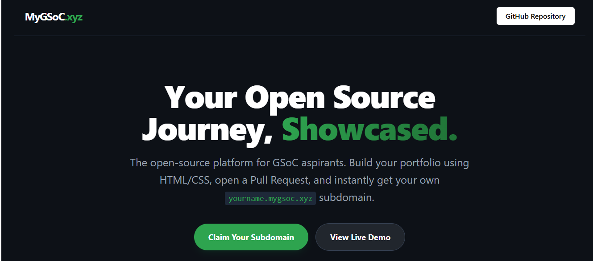

  

---
**The Open Source Portfolio Platform for GSoC Aspirants**

[Website](https://mygsoc.xyz) • [View Live Demo](http://demo.localhost:3000) • [Report an Issue](#)

---

## 📖 What is this?

**MyGSoC** is a free, open-source platform designed to help Google Summer of Code (GSoC) aspirants build, host, and showcase their open-source journey. 

By contributing to this repository, you aren't just building a portfolio—you are practicing the exact Git and GitHub workflow (Fork, Clone, Commit, PR) required to be a successful GSoC contributor.

Once your Pull Request is merged, our automated edge-routing instantly creates your portfolio at **`your-username.mygsoc.xyz`**.

---

## ✨ Features

* **Zero Backend Required:** Write plain HTML, CSS, and vanilla JS.
* **Instant Hosting:** Merged PRs are instantly deployed via Vercel.
* **Custom Subdomain:** Get a professional `username.mygsoc.xyz` link to share with mentors.
* **Built-in Templates:** Use our fully responsive dark-mode template as a starting point.

---

## 🛠️ How to Get Your Subdomain (Contribution Guide)

Getting your portfolio live takes less than 10 minutes. Follow these exact steps:

### Step 1: Fork & Clone
1. Click the **Fork** button at the top right of this repository.
2. Clone your forked repository to your local machine:

        git clone https://github.com/Mygsoc/mygsoc.git
        cd mygsoc

### Step 2: Create Your Folder
1. Navigate to the `public/` directory.
2. Create a new folder named **exactly** after your GitHub username (e.g., `public/octocat/`).

### Step 3: Build Your Page
1. Add your `index.html`, `style.css`, and any images to your new folder. 
2. **Need a head start?** Copy the files from the `public/demo/` folder into your new folder and customize the text and colors!
3. *Important:* Always use relative links in your HTML. (Use `<link href="./style.css">`, NOT `<link href="/style.css">`).

### Step 4: Commit & Push

        git add public/your-username/
        git commit -m "Add portfolio for [your-username]"
        git push origin main

### Step 5: Open a Pull Request
Come back to this original repository and click **Compare & pull request**. Once our maintainers review and merge your code, your site will be live at `your-username.mygsoc.xyz` within seconds!

---

## 💻 Local Development (For Maintainers or Testing)

Want to test how your page looks with the wildcard subdomain routing before making a PR? 

1. Install dependencies:

        npm install

2. Start the local development server:

        npm run dev

3. Test your personal route in your browser!
   👉 `http://your-username.localhost:3000`

---

## ⚠️ Repository Rules

To keep this platform safe and functional for everyone, please adhere to the following rules:

1. **Only touch your folder:** Do not modify `proxy.ts`, `app/page.tsx`, or any files outside of `public/your-username/`. PRs modifying core architecture will be automatically rejected.
2. **No malicious code:** All PRs are manually reviewed. Do not include external tracking scripts, crypto miners, or malicious payloads.
3. **Keep it relevant:** This is a professional platform for open-source portfolios. Keep the content focused on your projects, tech stack, and GSoC goals.

---

## 🤝 Community & Mentorship

Building open source is better together! If you are stuck on Git, need help centering a `div`, or want someone to review your GSoC proposal, open an issue labeled `help-wanted` and the community will step in.

  
<i>Built by the Open Source Community, for the Open Source Community.</i>

  
Not affiliated with Google or the official Google Summer of Code program.

